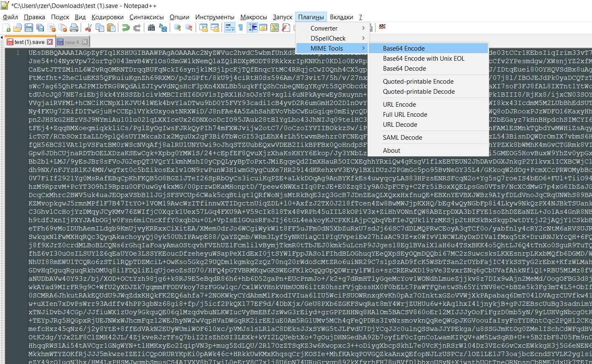

# RenPy Web Save Extractor/Injector

These scripts allow you to extract RenPy web File Data content from IndexedDB browser storage and inject them back.

1. Find your save name in Developer Tools:

   

2. Change **key** variable in **BOTH** files according to save file name

   

3. Copy full 1_ExtractSaveToFile.js content to Developer Console and Hit Enter: "extracted.save" file will be downloaded

4. You can edit it in any online tool like: [saveeditonline.com](https://www.saveeditonline.com/)

5. Download modified .save file and convert it to base64. In notepad++ you can do this by: ctrl+a to select all, then Plugins > MIME Tools > Base64 Encode

   

6. Insert this converted text to 2_InjectSaveToIndexedDb.js to **content** variable

7. Copy full 2_InjectSaveToIndexedDb.js content to Developer Console and Hit Enter: save will be replaced

8. Enjoy